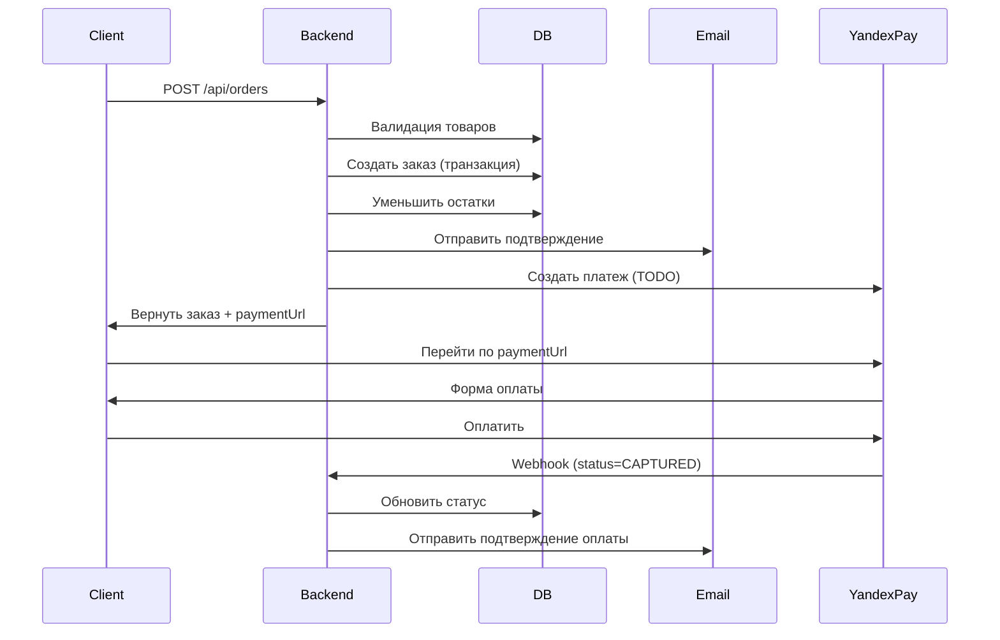

# 🛒 Оформление заказов с email уведомлениями

## ✅ Что реализовано

### 1. Email уведомления
- ✅ Подтверждение заказа (сразу после создания)
- ✅ Подтверждение оплаты (автоматически)
- ✅ Красивый HTML дизайн с таблицей товаров
- ✅ Отправка через Gmail SMTP

### 2. Упрощенная оплата
- ✅ Все заказы сразу оплачены (isPaid = true, status = PAID)
- ✅ Не требуется интеграция с платежными системами
- ⏳ Yandex Pay отложен на будущее

### 3. Orders API
- ✅ Валидация товаров и остатков на складе
- ✅ Отправка 2 email уведомлений
- ✅ Транзакция БД для атомарности
- ✅ Race condition защита
- ✅ Цены всегда из БД (не от клиента!)

---

## 🔧 Настройка

### Email (уже настроено)
```env
EMAIL_USER=mezovt123@gmail.com
EMAIL_PASS=lxxpzcdmftsswkqj
EMAIL_HOST=smtp.gmail.com
EMAIL_FROM=mezovt123@gmail.com
```
✅ **Работает!** Письма отправляются через Gmail SMTP.

### Оплата (упрощено)
Все заказы создаются сразу оплаченными:
- `isPaid = true`
- `status = PAID`
- Отправляются оба email сразу

⏳ **Yandex Pay** - отложен на будущее

---

## 🧪 Тестирование

### Проверить создание заказа и email

```bash
curl -X POST "https://saliy-shop.ru/api/orders" \
  -H "Content-Type: application/json" \
  -d '{
    "items": [{"productId": 20, "size": "M", "quantity": 1}],
    "firstName": "Тест",
    "lastName": "Тестов",
    "email": "mezovt123@gmail.com",
    "phone": "+375291234567",
    "deliveryType": "POST",
    "paymentMethod": "CARD"
  }'
```

**Ожидаемый результат:**
1. ✅ Заказ создан (status = PAID, isPaid = true)
2. ✅ Остатки уменьшены
3. ✅ 2 email получены:
   - Подтверждение заказа с составом
   - Подтверждение оплаты

---

## 📋 Flow оформления заказа



---

## 🚀 Деплой

### Переменные окружения на сервере

Убедитесь что на сервере есть все переменные:

```bash
# Email
EMAIL_USER=mezovt123@gmail.com
EMAIL_PASS=lxxpzcdmftsswkqj
EMAIL_HOST=smtp.gmail.com
EMAIL_FROM=mezovt123@gmail.com

# Yandex Pay (заполнить после регистрации)
YANDEX_PAY_SANDBOX=true
YANDEX_PAY_SANDBOX_API_KEY=твой_ключ_здесь
```

### Проверка работы

```bash
# 1. Проверить health
curl https://saliy-shop.ru/api

# 2. Создать тестовый заказ
curl -X POST https://saliy-shop.ru/api/orders \
  -H "Content-Type: application/json" \
  -d '{...}'

# 3. Проверить email (должен прийти на указанный адрес)

# 4. Проверить webhook
curl -X POST https://saliy-shop.ru/api/payment/webhook/yandex \
  -H "Content-Type: application/json" \
  -d '{"event":"ORDER_STATUS_UPDATED","object":{"id":"test","status":"CAPTURED"}}'
```

---

## 📊 Мониторинг

### Логи

Все операции логируются:
```
[OrdersService] Заказ создан: SALIY2603300001, товаров: 2, сумма: 19000 RUB
[OrdersService] Email уведомление отправлено: ivan@example.com
[YandexPayService] Платеж создан: orderId=SALIY2603300001
[PaymentController] Получен webhook от Yandex Pay
[OrdersService] Статус заказа обновлен: SALIY2603300001, status=PAID
```

### Ошибки

Ошибки email не блокируют создание заказа:
```
[OrdersService] Не удалось отправить email: Connection refused
```
Заказ создается, но email не отправляется.

---

## 🔜 TODO (что добавить дальше)

1. **Создание платежа в Yandex Pay:**
   - Вызывать `yandexPayService.createPayment()` при создании заказа
   - Сохранять paymentUrl в БД
   - Возвращать paymentUrl клиенту

2. **Проверка подписи webhook:**
   - Реализовать `verifyWebhookSignature()` по документации

3. **Промокоды:**
   - Создать таблицу `promo_codes`
   - Реализовать `applyPromoCode()` в OrdersService

4. **Возвраты:**
   - API для создания возврата
   - Webhook для статусов возврата

---

## 📖 Документация

- [Полная документация по оплате](./docs/shop/payment.md)
- [Документация Yandex Pay](https://pay.yandex.ru/docs/ru)
- [Тестирование](https://pay.yandex.ru/docs/ru/testing)
