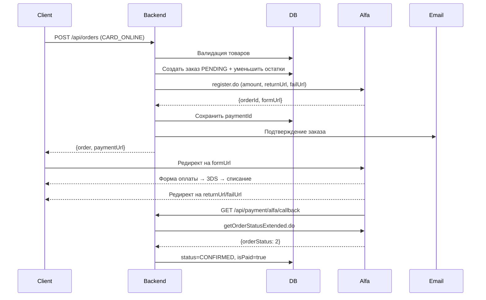

# 🛒 Оформление заказов + оплата через Альфа-Банк

## Что реализовано

### 1. Выбор метода оплаты

Пользователь выбирает из четырёх методов (`PaymentMethod`):

| Метод         | Что происходит                                                                                 |
|---------------|------------------------------------------------------------------------------------------------|
| `CARD_ONLINE` | Онлайн-оплата картой через **Альфа-Банк** (тест: `alfa.rbsuat.com`, прод: `pay.alfabank.ru`). Заказ создаётся в `PENDING`, в ответе `paymentUrl`, клиент редиректится на форму банка. |
| `CARD_MANUAL` | Оплата картой через менеджера. Заказ сразу `CONFIRMED` / `isPaid=true`.                        |
| `CRYPTO`      | Криптовалюта. Заказ сразу `CONFIRMED` / `isPaid=true`.                                         |
| `PAYPAL`      | PayPal. Заказ сразу `CONFIRMED` / `isPaid=true`.                                               |

### 2. Интеграция с Альфа-Банком (Alfa RBS)

- Подключён тестовый шлюз `https://alfa.rbsuat.com`.
- Реализовано:
  - Регистрация платежа: `POST /payment/rest/register.do` → получение `mdOrder` + `formUrl`.
  - Проверка статуса: `POST /payment/rest/getOrderStatusExtended.do`.
  - Callback от банка: `GET /api/payment/alfa/callback`.
  - Ручная синхронизация статуса: `POST /api/payment/alfa/check-status`.

### 3. Email уведомления

- ✅ Подтверждение заказа (сразу после создания, для всех методов оплаты)
- ✅ Отправка через Gmail SMTP
- ✅ Красивый HTML-шаблон с таблицей товаров

### 4. Orders API

- ✅ Валидация товаров и остатков на складе
- ✅ Цены всегда из БД (не от клиента!)
- ✅ Транзакция БД для атомарности
- ✅ Race-condition защита
- ✅ Автоматическое уменьшение остатков

---

## Настройка

### Email (уже настроено)

```env
EMAIL_USER=mezovt123@gmail.com
EMAIL_PASS=lxxpzcdmftsswkqj
EMAIL_HOST=smtp.gmail.com
EMAIL_FROM=mezovt123@gmail.com
```

### Альфа-Банк

`.env`:

```env
# Тестовая платёжка (UAT)
ALFA_BASE_URL=https://alfa.rbsuat.com
ALFA_API_USERNAME=r-saliyclothes_vercel-api
ALFA_API_PASSWORD=saliyclothes_vercel*?1

# Для возвратного URL после оплаты
FRONTEND_URL=https://saliyclothes.vercel.app/
```

### Переход на прод

```env
ALFA_BASE_URL=https://pay.alfabank.ru
ALFA_API_USERNAME=<боевой логин>
ALFA_API_PASSWORD=<боевой пароль>
```

И **обязательно** прописать в личном кабинете Альфы адрес callback'а:

```
https://saliy-shop.ru/api/payment/alfa/callback
```

---

## Тестирование

### 1. Создать заказ с онлайн-оплатой

```bash
curl -X POST http://localhost:3000/api/orders \
  -H "Content-Type: application/json" \
  -d '{
    "items": [{"productId": 20, "size": "M", "quantity": 1}],
    "firstName": "Тест",
    "lastName": "Тестов",
    "email": "mezovt123@gmail.com",
    "phone": "+375291234567",
    "deliveryType": "CDEK_PICKUP",
    "paymentMethod": "CARD_ONLINE"
  }'
```

**Ожидаемый ответ** (сокращённо):
```json
{
  "orderNumber": "SALIY2604240001",
  "status": "PENDING",
  "isPaid": false,
  "paymentId": "1a2b3c4d-...",
  "total": 9000,
  "paymentUrl": "https://alfa.rbsuat.com/payment/merchants/..."
}
```

### 2. Открыть `paymentUrl` в браузере

Тестовые карты Альфы (UAT):

| Номер карты           | Результат            |
|-----------------------|----------------------|
| `4111 1111 1111 1111` | Успешная оплата (VISA) |
| `5555 5555 5555 4444` | Успешная оплата (MC) |
| `4000 0000 0000 0002` | Отказ банка          |

- Дата: любая будущая
- CVV/CVC: любые 3 цифры
- 3DS пароль: `12345678`

### 3. После оплаты статус заказа обновляется

- Альфа дёргает `/api/payment/alfa/callback` → backend вызывает `getOrderStatusExtended.do` → обновляет БД.
- Альфа редиректит клиента на `{FRONTEND_URL}/order/{orderNumber}?payment=success|fail`.

### 4. Принудительно проверить статус

Если callback не дошёл:

```bash
curl -X POST http://localhost:3000/api/payment/alfa/check-status \
  -H "Content-Type: application/json" \
  -d '{"orderNumber":"SALIY2604240001"}'
```

Ответ:
```json
{ "orderNumber": "SALIY2604240001", "orderStatus": 2, "status": "PAID" }
```

Одновременно в БД обновится `status=CONFIRMED`, `isPaid=true`.

### 5. Создать заказ без онлайн-оплаты (проверить старый flow)

```bash
curl -X POST http://localhost:3000/api/orders \
  -H "Content-Type: application/json" \
  -d '{
    "items": [{"productId": 20, "size": "M", "quantity": 1}],
    "firstName": "Тест",
    "lastName": "Тестов",
    "email": "mezovt123@gmail.com",
    "phone": "+375291234567",
    "deliveryType": "CDEK_PICKUP",
    "paymentMethod": "CARD_MANUAL"
  }'
```

Ответ: заказ сразу `status=CONFIRMED`, `isPaid=true`, `paymentUrl=null`.

---

## Flow оформления заказа (с Альфой)



---

## Мониторинг

### Логи

```
[OrdersService]   Заказ создан: SALIY2604240001, товаров: 2, сумма: 19000 RUB
[AlfaPayService]  Платеж зарегистрирован в Alfa: orderNumber=SALIY2604240001, mdOrder=1a2b3c4d-...
[OrdersService]   Email уведомление отправлено: ivan@example.com
[PaymentController] Alfa callback: orderNumber=SALIY2604240001, mdOrder=1a2b3c4d-..., operation=deposited, status=1
[AlfaPayService]  orderStatus=2 → PAID
[OrdersService]   Статус заказа обновлен: SALIY2604240001, status=CONFIRMED, isPaid=true
```

### Ошибки

- Ошибка email не блокирует создание заказа (логируется, но заказ остаётся).
- Ошибка регистрации платежа в Альфе → заказ помечается `PAYMENT_FAILED`, клиенту возвращается `400 Bad Request`.

---

## 🔜 TODO

1. **Подтверждение оплаты по email** — отправлять отдельное письмо, когда `isPaid` становится `true`.
2. **Проверка подписи callback** — требует отдельного secret-ключа от Альфы (параметр `checksum`).
3. **Возвраты (refund)** — `POST /payment/rest/refund.do` + API для инициирования возврата из админки.
4. **Reversal (отмена авторизации)** — `POST /payment/rest/reverse.do`.
5. **Повторная попытка оплаты** — сейчас нельзя повторно зарегистрировать платёж с тем же `orderNumber`, нужно создать новый заказ.

---

## 📖 Документация

- [Детали оплаты — docs/shop/payment.md](./docs/shop/payment.md)
- [API заказов — docs/shop/orders.md](./docs/shop/orders.md)
- [Документация Альфа-Банка (Ecommerce)](https://pay.alfabank.ru/ecommerce/instructions/merchantManual/pages/index/main.html)
- [Тестовые карты](https://pay.alfabank.ru/ecommerce/instructions/merchantManual/pages/index/testCards.html)
